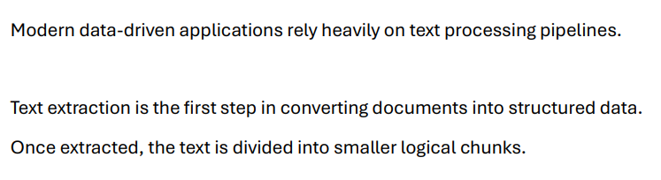
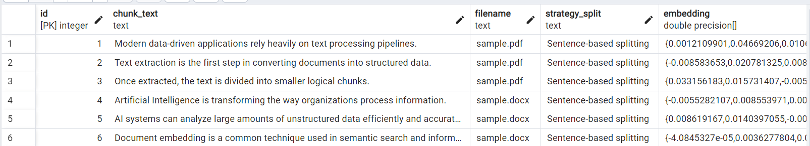

## **🤖** AI Document Indexer

### Prerequisites
- **Python** (Developed and tested with Python 3.9.7)
- **PostgreSQL** (via pgAdmin or another client)
- **Google AI Studio account** (for Gemini API key)

---

## ⚙️ Installation & Setup

### 1. Clone the Repository
```bash
git clone <repository-url>
```

### 2. Install Dependencies
```bash
python -m pip install pdfplumber python-docx nltk psycopg2-binary google-genai python-dotenv
```

### 3. Create a `.env` file in the project root with:
```env
GEMINI_API_KEY=your_google_api_key
POSTGRES_URL=postgresql://postgres:<password>@localhost:5432/ai_document_indexer
```

### ℹ️ Environment Variable Setup Instructions

#### 🤖 GEMINI_API_KEY
1. Go to [Google AI Studio](https://aistudio.google.com)
2. Click **Get API Key**
3. Click **Create API Key**
4. Choose a name and an existing project or create a new one
5. Copy the key and paste it into GEMINI_API_KEY

#### 🗄️ POSTGRES_URL
1. Open **pgAdmin**
2. Right-click on **Servers** → **Register** → **Server**
3. Set a name for the server (e.g. `AI Document Indexer`)
4. Go to the **Connection** tab:
   - **Host name/address**: `localhost`
   - **Username**: your PostgreSQL username (e.g. `postgres`)
   - **Password**: your PostgreSQL password
5. Click **Save**
6. Right-click on the newly created server → **Create** → **Database**
7. Set the database name to: `ai_document_indexer`
8. Click **Save**
9. Under the server, expand **Databases**
10. Right-click on `ai_document_indexer` → **Query Tool**
11. Paste the following SQL query and click **Execute**:

```sql
CREATE TABLE IF NOT EXISTS document_chunks (
    id SERIAL PRIMARY KEY,
    chunk_text TEXT NOT NULL,
    embedding FLOAT8[] NOT NULL,
    filename TEXT NOT NULL,
    strategy_split TEXT NOT NULL
);
```

### 4. Run the Application
```bash
python index_document.py
```

---

## 🖼️ Usage Examples & Screenshots

### 📄 PDF Input Example

The screenshot below shows the content of the processed PDF file before indexing:



### 📄 DOCX Input Example

The screenshot below shows the content of the processed DOCX file before indexing:


### 🗄️ Database Output Example

The screenshot below shows the stored chunks and embeddings inside the
`document_chunks` table after processing:

